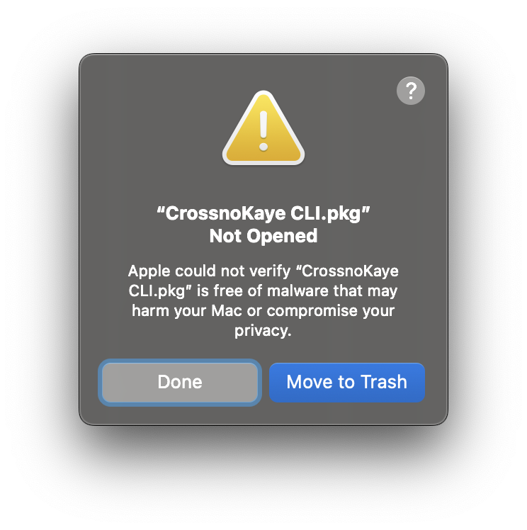
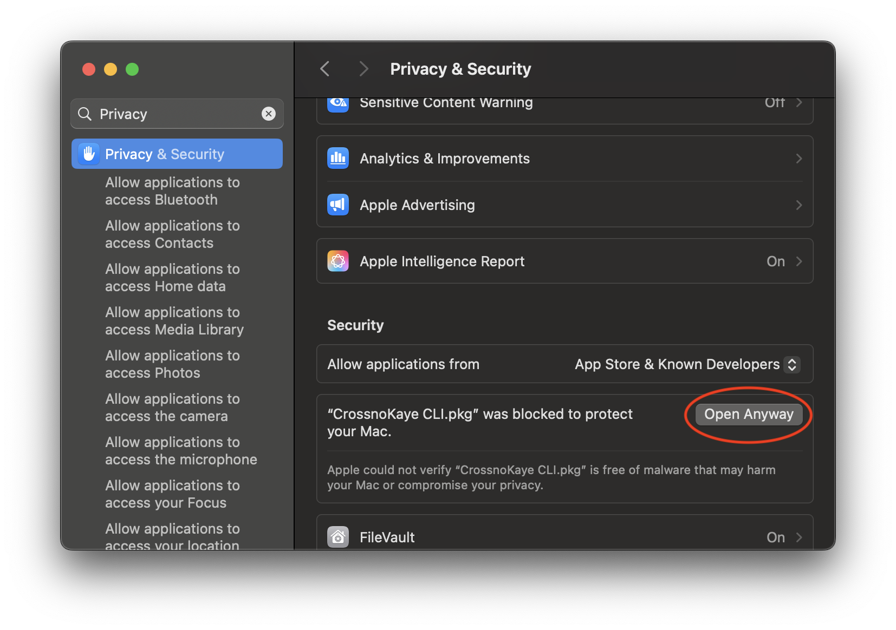

# CrossnoKaye Command Line Launcher

This is the easiest and best-supported way to use CrossnoKaye products from your terminal. It automatically installs, updates, and runs tools with simple commands, so you don't have to worry about downloading or managing different versions yourself.

Just install it (instructions below) and then, at your terminal, `ck foobar` to invoke the `foobar` tool. We'll download the tool for you; if we can't find it, we'll give you helpful pointers on how to locate it.

## One-Click Install

Download and run a suitable installer for your platform.

- Mac OS X
    - [All processors](https://github.com/xeger/ck/releases/latest/download/CrossnoKaye-CLI.pkg)
- Windows
    - [Intel processors](https://github.com/xeger/ck/releases/latest/download/CrossnoKaye-CLI-x64.msi)
    - [ARM processor](https://github.com/xeger/ck/releases/latest/download/CrossnoKaye-CLI-arm64.msi)

### Handling Security Prompts

We're working on obtaining code signing certificates from Apple and Microsoft; until this process is completed, you may need to complete a few extra steps to allow the installation through your system's security settings.

### Mac OS Users

You will probably see this warning when trying to run the `.pkg` installer.

To indicate that you trust us, open System Settings and find the Privacy & Security pane.

## Pre-Requisites

CrossnoKaye CLI uses the [GitHub CLI](https://cli.github.com) (`gh`) to download tools.
Please install it before using the CLI.

## Built-in Commands

**install** - `ck install <command>`
- Searches GitHub repositories: `crossnokaye/cli-{command}`, then `crossnokaye/{command}`
- Downloads latest release asset matching platform: `{command}_{tag}_{GOOS}_{GOARCH}.tar.gz`
- Extracts to `$XDG_DATA_HOME/crossnokaye/cli/cmd/{command}/`
- Writes version tracking info to `release.json`
- Requires GitHub CLI (`gh`) to be installed

**upgrade** - `ck upgrade <command>`
- Upgrades specified subcommand to latest release
- Checks current version and skips if already up-to-date
- Updates version tracking info
